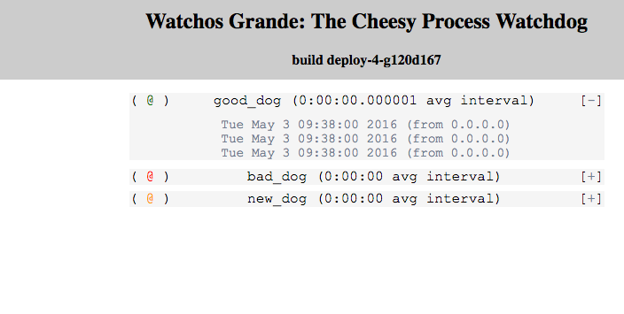

# Watchos Supreme #

## The Cheesy Process Watchdog! ##

**Watchos** (rhymes with *nachos*) does nothing but report the frequency at which a given URL endpoint is accessed. If a time longer than the sliding 10-hit window elapses since the last hit, then that endpoint's status light moves to red. If fewer than 10 hits have occurred, the endpoint's status light moves to yellow. Otherwise the status light is green. Endpoints are limited to 256, because that's a nice round number.

To enable monitoring in a script, simply invoke:

```curl -o http://<watchos_url>/watch/<a_url_valid_endpoint_name>```

which will create an endpoint called ```a_url_valid_endpoint_name```.

This README is available at ```http://<watchos_url>/help```.

